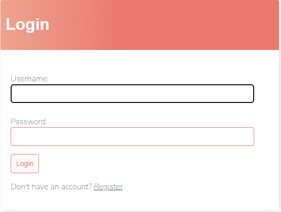
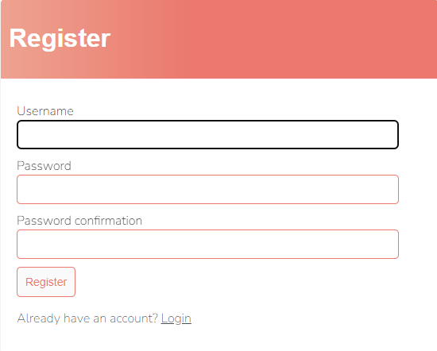
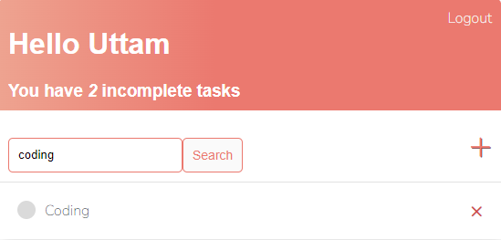

# To Do List
This repository contains a Django-based TODO list application implemented using class-based views. It provides a user friendly interface with User Registration, Login and CRUD functionality. Additionally, it features a search functionality to easily find specific tasks.

## Prerequisites
- Text Editor (VS Code)
- Git
- Python 3.4 or above
- Django 4.1

## Built with
- Python
- HTML
- CSS

## Installation

1. Clone the repository to your local machine.
```
git@github.com:uttamshr10/todolist.git
```

2. Navigate to `cd todolist`

3. Create virtual environment. 
```
virtualenv env
```

4. Activate the environment.
 ```
 env\Scripts\activate
 ```

5. Install the required dependencies.
``` 
pip install -r requirements.txt 
```

6. Start the development server.
```
python manage.py runserver
```

7. Open your web browser and visit `http://127.0.0.1:8000/` to access the TODO list application.

<p align="center"><b>Login</b></p>



<p align="center"><b>Register</b></p>



<p align="center"><b>Search Functionality</b></p>




# Author
## Uttam Shrestha
[](https://www.linkedin.com/in/uttam-shrestha-b96032224/)
 
[](https://github.com/uttamshr10)


# Contributing

Contributions are welcome! If you find any bugs or have any suggestions for improvements, please create an issue or a pull request.

# Contact

If you have any questions or feedback, feel free to contact me at utam.shrestha65@gmail.com
